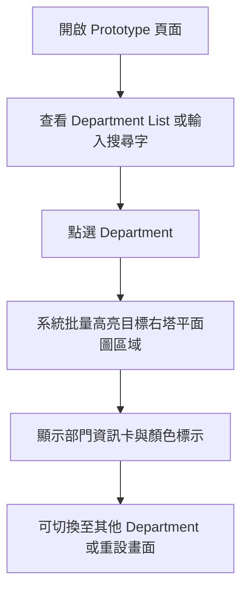

## 1. 產品概述
呢個 prototype 係一個互動式部門平面圖網頁，用 `Department List`、搜尋同圖上高亮，幫用家快速定位指定部門。
- 主要解決大型平面圖難以即時搵到 `27.01`、`07.03`、`27.03` 等 department 位置嘅問題
- 目標用戶包括設施管理、行政同展示用途，方便喺內聯網、平板或桌面畫面上快速查找

## 2. 核心功能

### 2.1 使用者角色
呢個 prototype 以單一公開查閱角色為主，暫時唔分權限。
| 角色 | 使用方式 | 核心權限 |
|------|----------|----------|
| 一般查閱者 | 直接開啟網頁 | 搜尋 department、點選清單、查看位置高亮與資訊 |

### 2.2 功能模組
1. **主畫面**：標題區、說明文字、搜尋列、department 清單、平面圖顯示區
2. **平面圖互動區**：顯示底圖、部門高亮框、圖例、定位資訊卡

### 2.3 頁面細節
| 頁面名稱 | 模組名稱 | 功能描述 |
|-----------|-----------|-----------|
| 主畫面 | 頂部資訊區 | 顯示 prototype 名稱、用途說明、目前選取狀態 |
| 主畫面 | 搜尋列 | 輸入 department code 或名稱後即時過濾清單 |
| 主畫面 | Department List | 顯示 department 清單，點擊後只高亮目標右塔區域，例如 `IPEB` target 只亮 `IPEB` 空間 |
| 主畫面 | 平面圖展示區 | 顯示用戶提供嘅樓層圖作為底圖 |
| 主畫面 | 高亮 Overlay | 以已分配顏色顯示半透明定位框、外框、動畫脈衝效果 |
| 主畫面 | 資訊卡 | 顯示 department code、全名、顏色標示同簡短說明 |

## 3. 核心流程
使用者開啟頁面後，可以直接從 department 清單揀選目標，或者先搜尋關鍵字，再點選結果，系統會根據現有資料來源即時批量高亮目標右塔空間；`IPEB` 模式下只會亮 `IPEB` 區域。

## 4. 使用者介面設計
### 4.1 設計風格
- 主色採用深藍灰背景、霓虹感高亮邊框，同 department 專屬顏色形成清晰對比
- 按鈕採用圓角膠囊式設計，配半透明面板同柔和陰影
- 字體以 `Noto Sans TC` / `PingFang TC` 為主，標題較粗，資訊文字保持清晰易讀
- 版面採用桌面優先雙欄布局，左側控制面板、右側主圖展示
- 圖例與提示標籤使用細緻顏色 chips，方便快速辨識

### 4.2 頁面設計概覽
| 頁面名稱 | 模組名稱 | UI 元素 |
|-----------|-----------|-----------|
| 主畫面 | 頂部資訊區 | 深色玻璃面板、標題、簡介、狀態文字 |
| 主畫面 | 搜尋與清單 | 搜尋框、彩色清單按鈕、Hover 與 Active 動畫 |
| 主畫面 | 平面圖展示區 | 大型底圖、半透明高亮框、角標、圖例 |
| 主畫面 | 資訊卡 | 部門代碼、完整名稱、顏色標記、說明文字、重設按鈕 |

### 4.3 響應式設計
- 採用桌面優先設計
- 桌面版使用左右分欄，提高圖面可視面積
- 平板與手機版改為上下堆疊，department 清單改成橫向或自動換行
- 觸控裝置需保持按鈕大小足夠，方便點擊
