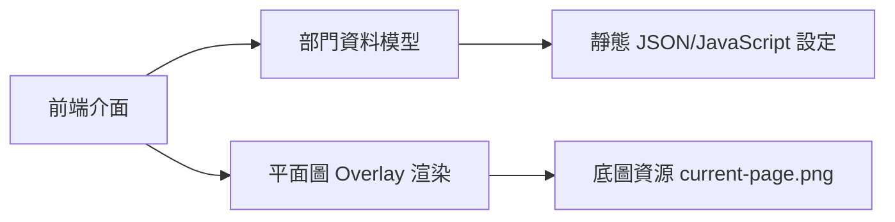
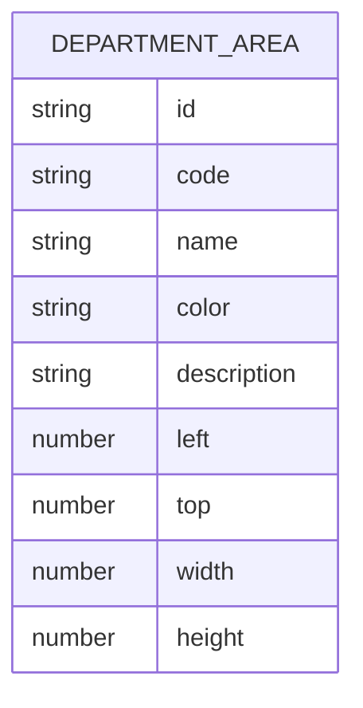

## 1. 架構設計


## 2. 技術說明
- 前端：原生 `HTML` + `CSS` + `JavaScript`
- 初始化方式：直接以單頁 `index.html` 實作，方便快速展示 prototype
- 後端：`None`
- 資料來源：前端內嵌 mock department 資料與座標設定

## 3. 路由定義
| 路由 | 用途 |
|------|------|
| / | 顯示互動式 department 平面圖 prototype |

## 4. API 定義
呢個 prototype 唔需要後端 API，資料直接喺前端定義。

```ts
type DepartmentArea = {
  id: string;
  code: string;
  name: string;
  color: string;
  description: string;
  bounds: {
    left: number;
    top: number;
    width: number;
    height: number;
  };
};
```

## 5. 資料模型
### 5.1 資料模型定義


### 5.2 資料定義說明
- 每個 department 以單一物件表示
- `bounds` 使用相對於底圖容器嘅百分比座標，方便日後替換圖片時微調
- prototype 先寫死三個 department：`27.01`、`07.03`、`27.03`
- 後續如要擴充，可將資料搬去獨立 JSON 或 CMS
